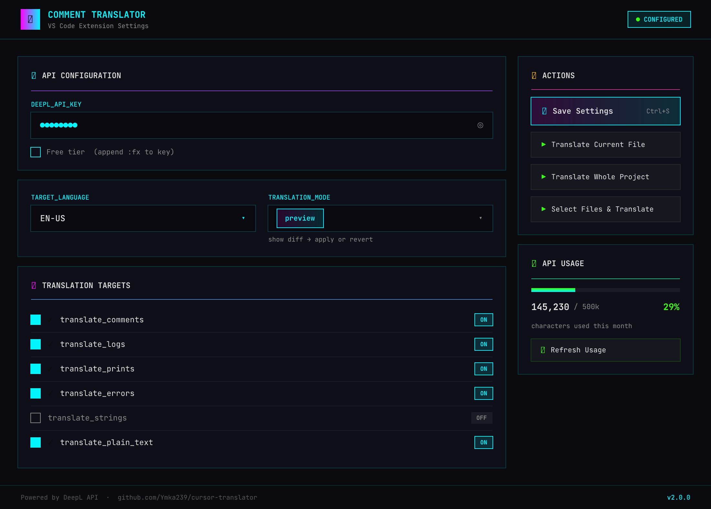

# Comment Translator

> VS Code & Cursor extension that translates comments, logs, print statements, and error messages in your codebase to any language.



---

## Features

- **Multi-language translation** powered by DeepL API (500k free characters/month)
- **Selective translation** — choose exactly what to translate:
  - Comments (single-line and multi-line)
  - Log statements (`console.log`, `logger.info`, etc.)
  - Print statements (`print`, `println`, `echo`, etc.)
  - Error messages (`throw new Error`, `raise Exception`, etc.)
  - Plain text files (`.txt`, `.md`)
  - String literals (optional)
- **Preview mode** — see a diff before applying any changes
- **Batch processing** — translate entire project or just selected files
- **Smart detection** — only non-English text is sent for translation
- **Works with all programming languages**

---

## Installation

### From VS Code Marketplace
*(coming soon)*

### From VSIX

1. Download the latest `.vsix` from [Releases](https://github.com/i-ymka/comment-translator/releases)
2. In VS Code: `Extensions` → `...` → `Install from VSIX`

### From Source

```bash
git clone https://github.com/i-ymka/comment-translator.git
cd comment-translator
npm install
npm run compile
```
Press `F5` in VS Code to launch Extension Development Host.

---

## Setup

1. Get a **free** DeepL API key at [deepl.com/pro-api](https://www.deepl.com/pro-api) (500k chars/month free)
2. Open the Comment Translator panel in the sidebar
3. Paste your API key and select target language

---

## Usage

**Via sidebar panel:**
1. Click the Comment Translator icon in the Activity Bar
2. Configure: API key, target language, what to translate, preview vs replace mode
3. Click Translate

**Via Command Palette** (`Ctrl+Shift+P` / `Cmd+Shift+P`):
- `Comment Translator: Translate Current File`
- `Comment Translator: Translate Whole Project`
- `Comment Translator: Translate Selected Files`

---

## Example

**Before** (Russian comments):
```python
# Вычисление суммы двух чисел
def calculate_sum(a, b):
    print("Складываем числа")
    return a + b
```

**After** (translated to English):
```python
# Calculating the sum of two numbers
def calculate_sum(a, b):
    print("Adding numbers")
    return a + b
```

---

## Supported Languages

English · German · French · Spanish · Italian · Portuguese · Russian · Japanese · Chinese · Korean · and more via DeepL

---

## Settings

| Setting | Description | Default |
|---------|-------------|---------|
| `commentTranslator.deeplApiKey` | DeepL API key | `""` |
| `commentTranslator.targetLanguage` | Target language | `EN-US` |
| `commentTranslator.translateComments` | Translate comments | `true` |
| `commentTranslator.translateLogs` | Translate log statements | `true` |
| `commentTranslator.translatePrints` | Translate print statements | `true` |
| `commentTranslator.translateErrors` | Translate error messages | `true` |
| `commentTranslator.translateStrings` | Translate string literals | `false` |
| `commentTranslator.mode` | `preview` or `replace` | `preview` |
| `commentTranslator.scope` | `currentFile` or `wholeProject` | `currentFile` |

---

## License

MIT — free to use, modify, and distribute.

---

*Powered by [DeepL API](https://www.deepl.com/pro-api)*
